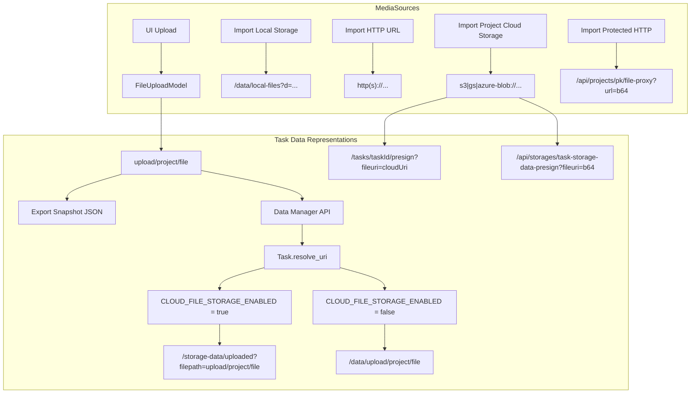
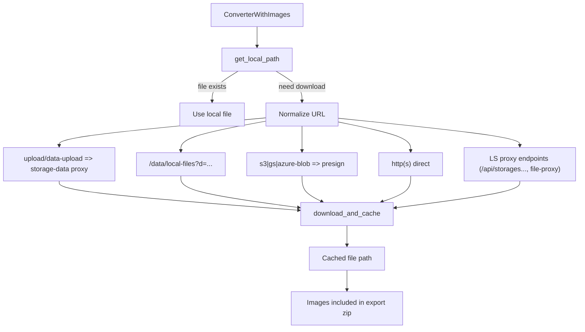
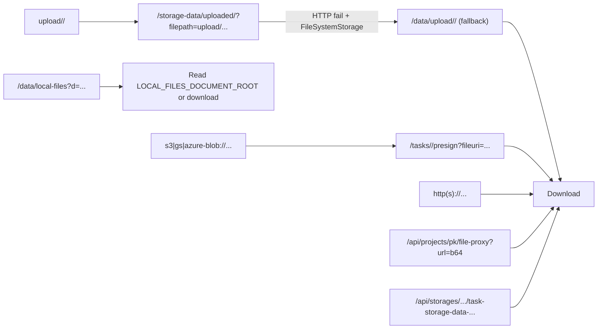

# Label Studio Tools Core Utils

## Overview
Utilities used by Label Studio converters. `io.py` resolves task media references to **local file paths**, downloading and caching when needed. This is critical for `*_WITH_IMAGES` exports—failed downloads lead to empty `images/` folders.

Also, these tools are used in Label Studio ML backend. 

---

## Diagram 1: Where URLs Come From



---

## Diagram 2: Downloader Flow (`get_local_path`)


---

## Diagram 3: URL Shapes & Normalization


---

## Key Points
- **Upload key is always stored as** `upload/<project>/<file>` (snapshots keep this).
- **Local FileSystemStorage (default)**:
  - Downloader tries `/storage-data/uploaded/?filepath=upload/...`; on HTTP failure (e.g., nginx + FileSystemStorage), it falls back to `/data/upload/<project>/<file>`.
- **Cloud default storage (S3/GCS/Azure/minio)**:
  - Downloads via `/storage-data/uploaded/?filepath=upload/<project>/<file>` with auth; `/data/upload/...` is not expected to exist.
- **Project storage**:
  - Local Storage: `/data/local-files?d=...` (read locally or download from host).
  - Project cloud storage: `s3://…`, `gs://…`, `azure-blob://…` → `/tasks/<task_id>/presign/?fileuri=...`.
- **Direct URLs**: `http(s)://...` (auth only if host matches `hostname`).
- **Auth**: `Token <token>` for legacy API tokens; `Bearer <token>` for JWT access tokens (when host matches `hostname`).

## Usage
```python
from label_studio_sdk._extensions.label_studio_tools.core.utils.io import get_local_path

local_path = get_local_path(
    url=item["input"]["image"],
    hostname="https://my-ls.example.com",
    access_token=os.environ["LABEL_STUDIO_API_KEY"],
    cache_dir="/tmp/export/images",
    download_resources=True,
    task_id=item["id"],
)
```

## Environment Variables
- `LABEL_STUDIO_URL` / `LABEL_STUDIO_HOST`
- `LABEL_STUDIO_API_KEY` / `LABEL_STUDIO_ACCESS_TOKEN`
- `LOCAL_FILES_DOCUMENT_ROOT`
- `VERIFY_SSL`

## API Reference
- `get_local_path(...)`: resolve & download to local path.
- `download_and_cache(...)`: low-level download/cache helper.
- `get_base64_content(...)`: download and return base64.

## Development Notes
- Tests in `tests/custom/label_studio_tools/` cover URL normalization, auth, and upload→proxy→fallback.
- Converter regressions in `tests/custom/converter/` for image-inclusive formats.

## Other Points
- Snapshots may contain raw upload keys; downloader must handle both raw uploads and proxy URLs.
- Some LS proxy endpoints embed filenames in query params—extend filename inference as needed (pattern: `/storage-data/uploaded/?filepath=...`).
