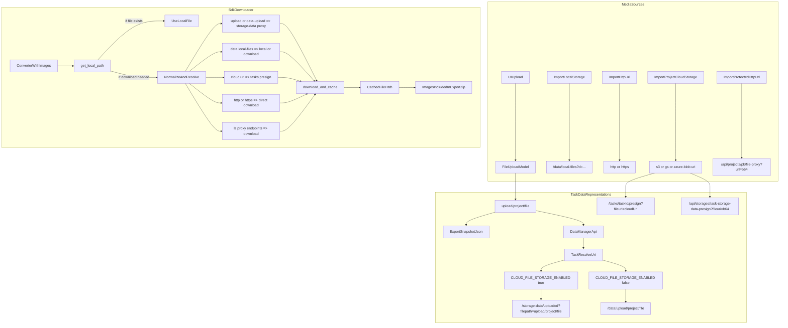

# Label Studio Tools Core Utils

## Overview
This folder contains SDK-side utility helpers used by Label Studio converters and tools.
The most critical one for exports with images is `io.py`, which turns task media references
into **local file paths** by downloading and caching remote resources.

This matters for `*_WITH_IMAGES` export formats, where missing downloads silently result in
empty `images/` folders in the exported archive.

## Architecture
The diagram below shows:
- **Where file references come from** in Label Studio
- **How they are represented** in different APIs and export snapshots
- **How `get_local_path` normalizes and downloads them**



## Key Features
- **Upload key support**: Handles `upload/<project>/<file>` and `/data/upload/...` paths, including the
  export snapshot case where raw upload keys are present in JSON.
- **Storage proxy support**: Handles `/storage-data/uploaded/?filepath=...` URLs and derives the cached filename
  from the `filepath` query param to preserve extensions.
- **Local Storage support**: Handles `/data/local-files?d=...` and optionally reads directly from disk via
  `LOCAL_FILES_DOCUMENT_ROOT` when available.
- **Project cloud storage support**: Handles `s3:`, `gs:`, and `azure-blob:` URIs via the task presign endpoint.
- **Authentication**: Adds `Authorization` header for Label-Studio-hosted URLs:
  - `Token <token>` for legacy API tokens
  - `Bearer <token>` for well-formed JWT access tokens

## URL and Path Shapes
The downloader recognizes and normalizes the following patterns:

| Source | Example value in task data | Where it typically appears | How `get_local_path` handles it |
|---|---|---|---|
| UI upload key | `upload/8/file.jpg` | Export snapshots | Normalizes to `/data/upload/...`, then rewrites to `/storage-data/uploaded/?filepath=upload/...` for downloading |
| UI upload proxy | `/storage-data/uploaded/?filepath=upload/8/file.jpg` | DataManager API when cloud default storage is enabled | Rewrites host to `hostname`, requires auth, uses `filepath` for filename |
| UI upload download | `/data/upload/8/file.jpg` | DataManager API when default storage is local FS | Downloads from host or uses local disk if `image_dir` exists |
| Local Storage | `/data/local-files?d=dir/file.jpg` | Tasks using Local Storage | Reads locally via `LOCAL_FILES_DOCUMENT_ROOT` when possible, otherwise downloads from host |
| Project cloud storage | `s3://bucket/prefix/file.jpg` | Tasks imported from cloud storages | Requires `task_id`, uses `/tasks/<task_id>/presign?fileuri=...` then downloads |
| Direct URL | `https://example.com/file.jpg` | Tasks with external data links | Downloads directly, no LS auth unless host matches `hostname` |
| LSE file proxy | `/api/projects/<pk>/file-proxy/?url=<b64>` | Tasks with basic-auth protected HTTP data | Treated as an LS-hosted HTTP URL, downloaded with auth if host matches `hostname` |
| Storage proxy endpoints | `/api/storages/.../task-storage-data-.../?fileuri=<b64>` | Tasks resolved by project storage proxy | Treated as LS-hosted HTTP URL, downloaded with auth if host matches `hostname` |

## Usage
Minimal use in converters:

```python
from label_studio_sdk._extensions.label_studio_tools.core.utils.io import get_local_path

local_path = get_local_path(
    url=item["input"]["image"],
    hostname="https://my-ls.example.com",
    access_token=os.environ["LABEL_STUDIO_API_KEY"],
    cache_dir="/tmp/export/images",
    download_resources=True,
    task_id=item["id"],
)
```

Environment variables used:
- `LABEL_STUDIO_URL` / `LABEL_STUDIO_HOST`: default hostname for resolving LS-internal URLs
- `LABEL_STUDIO_API_KEY` / `LABEL_STUDIO_ACCESS_TOKEN`: auth token used for downloads
- `LOCAL_FILES_DOCUMENT_ROOT`: root for Local Storage direct reads
- `VERIFY_SSL`: set `False` to bypass SSL verification for debugging

## API Reference
- `get_local_path(...)`: Resolve a task media reference to a local file path, downloading if needed.
- `download_and_cache(...)`: Low-level download + cache helper, builds deterministic filenames.
- `get_base64_content(...)`: Download a resource and return base64 without writing to disk.

## Development
- Add tests in `label-studio-sdk/tests/custom/label_studio_tools/` for URL normalization and auth behavior.
- Add converter regression tests in `label-studio-sdk/tests/custom/converter/` for formats that include images.

## Other Points
- Export snapshots can contain **raw upload keys** instead of `/storage-data/...` proxy URLs. The downloader must
  handle both representations for the same underlying file.
- If using JWT-based auth, the downloader expects a **JWT access token** for `Bearer` auth. Refresh tokens are not
  accepted by the API endpoints that serve files.
- Some LS proxy endpoints encode the real filename inside query parameters. If the cached filename must preserve an
  extension, consider extending filename inference similarly to how `/storage-data/uploaded/?filepath=...` is handled.
